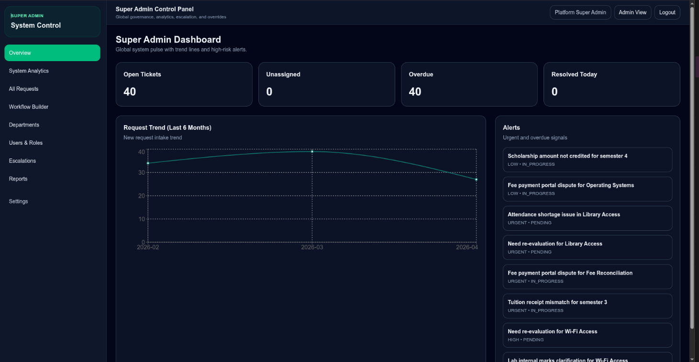
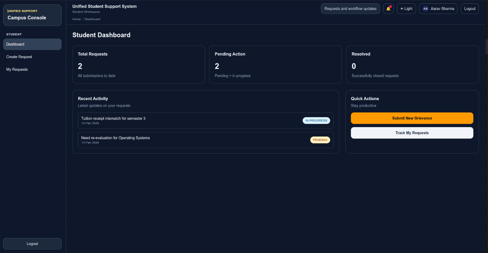
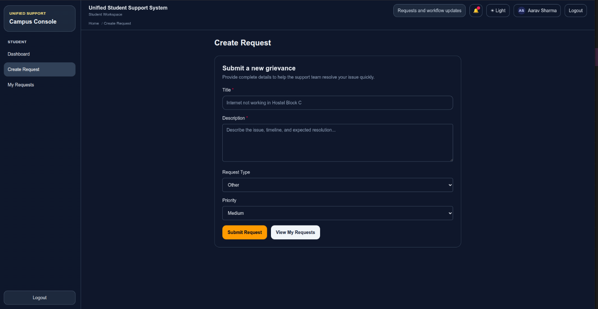
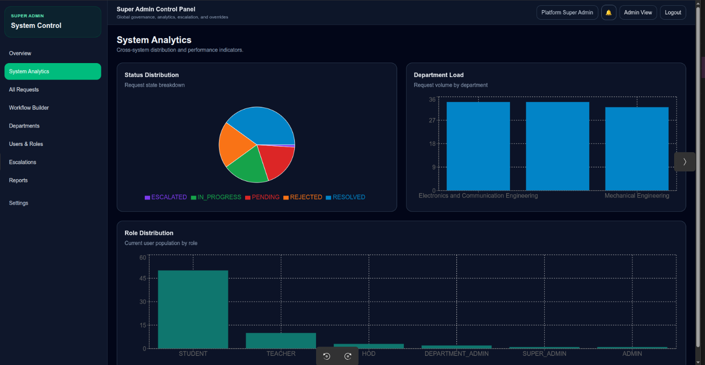
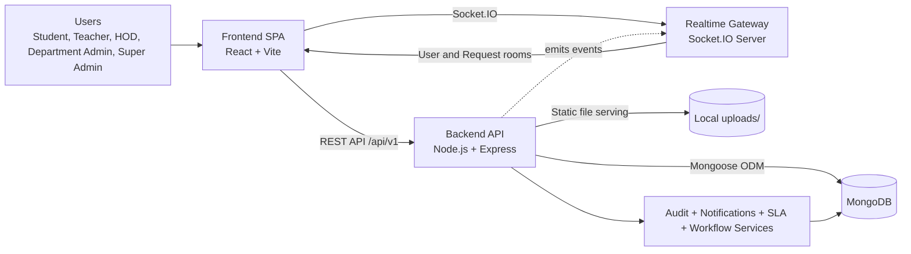
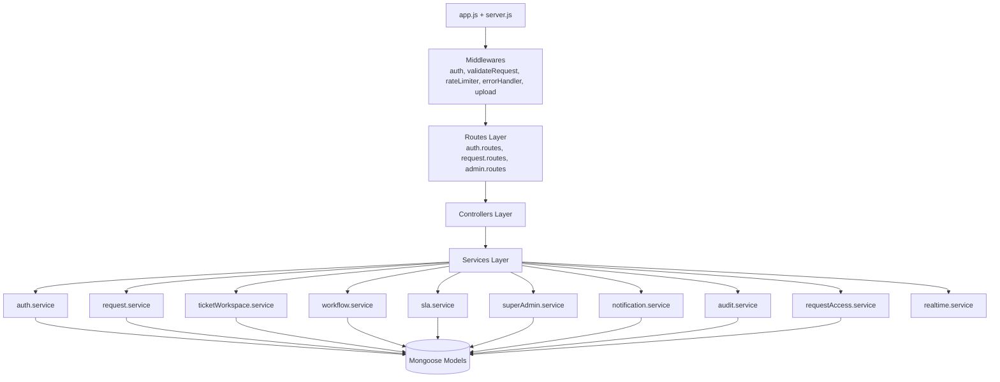
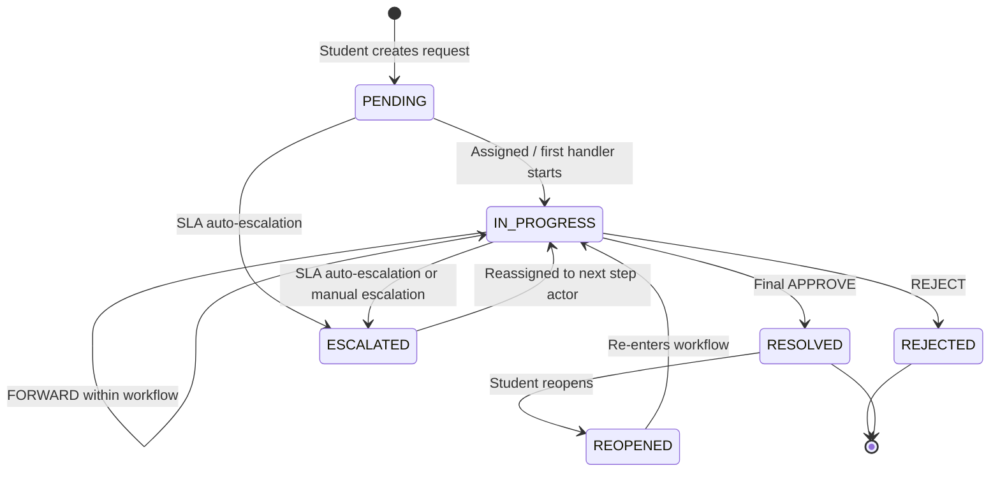
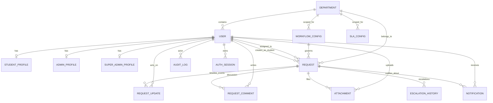

# Unified Student Support, Request and Grievance Management System

This project is an end-to-end grievance platform with:

- Backend API: Node.js, Express, MongoDB, JWT, Zod validation
- Frontend App: React (Vite), role-aware routing and operations dashboards

Current stage:

- Multi-role hierarchy is active: STUDENT, TEACHER, HOD, DEPARTMENT_ADMIN, SUPER_ADMIN, legacy ADMIN
- Workflow-based approvals are active with step progression and approval history
- Department and workflow configuration modules are active
- Frontend is redesigned and fully connected to upgraded backend contracts

## Screenshots






## Architecture Diagrams

### A. System Context (Frontend + Backend + Realtime + Data)



### B. Backend Component Architecture



### C. Request Lifecycle and Workflow Progression



### D. Core Data Model Relationships



## 1. Current Functional Scope

### Frontend

- Auth and session:
  - Student login and registration
  - Admin login and registration with signup key
  - Token persistence in localStorage
  - Session bootstrap through GET /api/v1/auth/me
- Routing and access:
  - Protected route shell
  - Role-aware redirects and page gating
  - Admin hierarchy routes for dashboards and config pages
- Student features:
  - Dashboard metrics and recent activity
  - Create request form
  - My requests list with filters/search
- Operations features:
  - Admin dashboard with scoped stats and urgent queue
  - Request operations page with filters, assignment, workflow actions
  - Request details side drawer with approval timeline
  - Department management page (SUPER_ADMIN)
  - Workflow config management page (DEPARTMENT_ADMIN, SUPER_ADMIN, ADMIN)
- UX behavior:
  - Toast feedback for success/error actions
  - Optimistic updates on assign/action/config operations

### Backend

- Health and core middleware:
  - GET /health
  - JWT authentication and role authorization
  - Request validation via Zod
  - Auth rate limiting
  - Centralized error handling
- Auth:
  - Student register/login
  - Admin register/login
  - Current user via /auth/me
- Student request flow:
  - Create/list/get/update-own requests
  - Request updates timeline endpoint
- Workflow and approvals:
  - POST /requests/:id/action with APPROVE | REJECT | FORWARD
  - Per-step role checks and automatic next-step assignment
  - approvalHistory persisted on requests
- Admin operations:
  - Scoped request listing, status updates, assignment
  - Dashboard stats and assignable users
  - Department CRUD
  - Workflow config CRUD
- Recent reliability fixes:
  - CORS support for configured origins and local dev ports
  - Admin profile employeeId generation during signup to avoid duplicate-null unique collisions

## 2. Role Matrix

- STUDENT:
  - Can manage own requests
- TEACHER:
  - Can act on assigned workflow steps
- HOD:
  - Department-scoped operations access
  - Workflow action access
- DEPARTMENT_ADMIN:
  - Department-scoped operations access
  - Workflow config management in scope
- SUPER_ADMIN:
  - Full scope, including department management
- ADMIN (legacy compatibility role):
  - Supported for backward compatibility
  - Treated as operations/admin actor in role checks

## 3. Frontend Routes

Public routes:

- /login
- /register
- /admin/login
- /admin/register

Student routes:

- /dashboard
- /create-request
- /my-requests

Operations routes:

- /admin/dashboard (ADMIN_ROLES)
- /admin/requests (ADMIN_ROLES)
- /admin/workflows (ADMIN, DEPARTMENT_ADMIN, SUPER_ADMIN)
- /admin/departments (SUPER_ADMIN)

## 4. Backend API Reference

Base URL:

- http://localhost:5000/api/v1

Global health endpoint:

- GET /health

Auth header for protected routes:

- Authorization: Bearer <JWT_TOKEN>

### 4.1 Response Contracts

Success shape:

```json
{
  "success": true,
  "message": "...",
  "data": {},
  "meta": null
}
```

Error shape:

```json
{
  "success": false,
  "message": "...",
  "errors": []
}
```

### 4.2 Auth Endpoints

- POST /auth/register
- POST /auth/login
- POST /auth/admin/register
- POST /auth/admin/login
- GET /auth/me

Notes:

- /auth/admin/register requires adminSignupKey matching ADMIN_SIGNUP_KEY
- /auth/admin/login allows ADMIN, DEPARTMENT_ADMIN, HOD, SUPER_ADMIN

### 4.3 Student Endpoints

- POST /requests
- GET /requests/my
- GET /requests/:id
- PATCH /requests/:id
- GET /requests/:id/updates

### 4.4 Workflow Action Endpoint

- POST /requests/:id/action

Allowed roles:

- TEACHER, HOD, DEPARTMENT_ADMIN, SUPER_ADMIN, ADMIN

Payload:

```json
{
  "action": "APPROVE",
  "remark": "Optional note"
}
```

Allowed action values:

- APPROVE
- REJECT
- FORWARD

### 4.5 Operations Endpoints

- GET /admin/requests
- PATCH /admin/requests/:id/status
- PATCH /admin/requests/:id/assign
- GET /admin/dashboard/stats
- GET /admin/users
- GET /admin/departments
- POST /admin/departments
- PATCH /admin/departments/:id
- DELETE /admin/departments/:id
- GET /admin/workflows
- POST /admin/workflows
- PATCH /admin/workflows/:id
- DELETE /admin/workflows/:id

## 5. Core Models

- User
  - role enum includes STUDENT, TEACHER, HOD, DEPARTMENT_ADMIN, SUPER_ADMIN, ADMIN
  - departmentId relation available
- Request
  - workflowId, departmentId, currentStep, taggedTeacherId
  - approvalHistory array with actor/role/action/remark/timestamp
- RequestUpdate
  - timeline feed for operational events
- Department
  - name, code, hodId, teachers
- WorkflowConfig
  - requestType, departmentId, steps, isActive
- StudentProfile
- AdminProfile

## 6. Frontend API Client Map

authApi:

- register
- login
- adminRegister
- adminLogin
- getMe

studentApi:

- createRequest
- listMyRequests
- getRequestById
- updateRequest
- getRequestUpdates

adminApi:

- listRequests
- updateStatus
- assignRequest
- requestAction
- getDashboardStats
- listAdmins
- listDepartments
- createDepartment
- updateDepartment
- deleteDepartment
- listWorkflows
- createWorkflow
- updateWorkflow
- deleteWorkflow

## 7. Environment Variables

Backend required:

- MONGODB_URI
- JWT_SECRET

Backend optional:

- NODE_ENV
- PORT
- JWT_EXPIRES_IN
- ADMIN_SIGNUP_KEY
- CORS_ORIGINS
- ADMIN_EMAIL, ADMIN_PASSWORD, ADMIN_NAME, ADMIN_DEPARTMENT

Frontend optional:

- VITE_API_BASE_URL (default: http://localhost:5000/api/v1)

## 8. Local Run Commands

Backend:

```bash
cd backend
npm install
npm run dev
```

Frontend:

```bash
cd frontend
npm install
npm run dev
```

Seed/migrate helpers:

```bash
cd backend
npm run seed:admin
npm run seed:db
npm run migrate:profiles
```

## 9. Current QA Status

- Frontend lint/build: passing
- Backend syntax checks: passing
- E2E smoke checks:
  - Auth and role logins working
  - Request workflow action API working
  - Department/workflow list endpoints working
  - Admin register flow fixed after CORS and employeeId patches

## 10. AI Context Pack

Use this in a new chat when you need fast continuity:

```text
Project: Unified Student Support, Request and Grievance Management System.
Stack: Backend (Express+MongoDB+JWT+Zod), Frontend (React+Vite+Router).
Roles: STUDENT, TEACHER, HOD, DEPARTMENT_ADMIN, SUPER_ADMIN, legacy ADMIN.

Frontend routes:
- Public: /login, /register, /admin/login, /admin/register
- Student: /dashboard, /create-request, /my-requests
- Operations: /admin/dashboard, /admin/requests, /admin/workflows, /admin/departments

Backend base: /api/v1
Health: GET /health

Auth APIs:
- POST /auth/register
- POST /auth/login
- POST /auth/admin/register
- POST /auth/admin/login
- GET /auth/me

Student APIs:
- POST /requests
- GET /requests/my
- GET /requests/:id
- PATCH /requests/:id
- GET /requests/:id/updates

Workflow action API:
- POST /requests/:id/action with APPROVE|REJECT|FORWARD

Operations APIs:
- GET /admin/requests
- PATCH /admin/requests/:id/status
- PATCH /admin/requests/:id/assign
- GET /admin/dashboard/stats
- GET /admin/users
- GET|POST|PATCH|DELETE /admin/departments
- GET|POST|PATCH|DELETE /admin/workflows

Enums:
- type: ACADEMIC|FINANCE|HOSTEL|INFRASTRUCTURE|OTHER
- priority: LOW|MEDIUM|HIGH|URGENT
- status: PENDING|IN_PROGRESS|RESOLVED|REJECTED

Response contracts:
- Success: { success:true, message, data, meta }
- Error: { success:false, message, errors }
```
